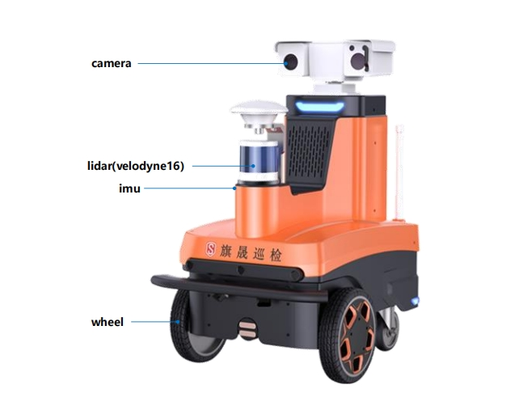

<div align="center">
    <h2><strong>Adaptive-LIO: Enhancing Robustness and Precision through Environmental Adaptation in LiDAR Inertial Odometry</strong></h2>
</div>

<div align="center">
    <a href="https://github.com/chengwei0427" target='_blank'>Chengwei Zhao</a><sup>#,1,2</sup>&nbsp;&nbsp;&nbsp;
    <a href="https://github.com/KJ-Falloutlast" target='_blank'>Kun hu</a><sup>#,3</sup>&nbsp;&nbsp;&nbsp;
    <a href="https://github.com/jiejie567" target='_blank'>Jie Xu</a><sup>*,1,5</sup>&nbsp;&nbsp;&nbsp;
    <a href="https://orcid.org/0000-0002-9108-8276" target='_blank'>Lijun Zhao</a><sup>*,1</sup>&nbsp;&nbsp;&nbsp;
    <a href="https://orcid.org/0009-0009-0503-8810" target='_blank'>Baiwen Han</a><sup>1</sup>&nbsp;&nbsp;&nbsp;
    <a href="https://orcid.org/0009-0005-3938-7454" target='_blank'>Kaidi Wu</a><sup>3</sup>
    <a href="https://orcid.org/0009-0007-0403-8961" target='_blank'>Maoshan Tian</a><sup>4</sup>
    <a href="https://github.com/snakehaihai" target='_blank'>Shenghai Yuan</a><sup>5</sup>
    </br></br>
    <sup>1</sup>HIT&nbsp;&nbsp;&nbsp;
    <sup>2</sup>Qisheng Intelligent Techology&nbsp;&nbsp;&nbsp;
    <sup>3</sup>CUMT(XuZhou)&nbsp;&nbsp;&nbsp;
    <sup>4</sup>UESTC&nbsp;&nbsp;&nbsp;
    <sup>5</sup> NTU
    </br></br>
    (#-co-first authors)        (*-corresponding authors)
</div>

<div align="center">
    </br>
    <a href="https://ieeexplore.ieee.org/document/10806842" target='_blank'>
        
    </a>&nbsp;
    <a href="https://hits.seeyoufarm.com">
        
  </a>
</div>

# About
The emerging Internet of Things (IoT) applications, such as driverless cars, have a growing demand for high-precision positioning and navigation. Nowadays, LiDAR inertial odometry becomes increasingly prevalent in robotics and autonomous driving. However, many current SLAM systems lack sufficient adaptability to various scenarios. Challenges include decreased point cloud accuracy with longer frame intervals under the constant velocity assumption, coupling of erroneous IMU information when IMU saturation occurs, and decreased localization accuracy due to the use of fixed-resolution maps during indoor-outdoor scene transitions. To address these issues, we propose a loosely coupled adaptive LiDAR-Inertial-Odometry named **Adaptive-LIO**, which incorporates adaptive segmentation to enhance mapping accuracy, adapts motion modality through IMU saturation and fault detection, and adjusts map resolution adaptively using multi-resolution voxel maps based on the distance from the LiDAR center. Our proposed method has been tested in various challenging scenarios, demonstrating the effectiveness of the improvements we introduce.


## :memo: Updates

- \[2024.12\] - **Adaptive-lio** is accepted to JIOT 2024. :rocket:
- \[2025.03\] - **Code release**

# Data Sequence without strict time synchronization and calibration

##  Platform

<div align="center">
  <div align="center">
    
  </div>
  <font color=#a0a0a0 size=2>Qisheng L1 mobile chassis.</font>
</div>

**notes**: The experimental platform is the Qisheng L1 mobile chassis, which features dual-wheel differential steering. It is equipped with a Velodyne VLP-16 and an external IMU, using an Intel Core i5 as the computing platform. Please note that our IMU and LiDAR have not undergone hardware time synchronization, and the extrinsics betweenthe LiDAR and IMU have not been strictly calibrated.

##  Dataset

<table>
  <tr>
    <th style="text-align:center">Dataset</th>
    <th style="text-align:center">Full Name</th>
    <th style="text-align:center">Duration (s)</th>
    <th style="text-align:center">Distance (km)</th>
    <th style="text-align:center">LiDAR Type</th>
  </tr>
  <tr>
    <td style="text-align:center">QiSheng</td>
    <td style="text-align:center"><a href="https://pan.baidu.com/s/1FBHpDxpykGApxJESxXfk5Q?pwd=yjad" target="_blank">industrial</td>
    <td style="text-align:center">485</td>
    <td style="text-align:center">00</td>
    <td style="text-align:center">Velodyne VLP-16</td>
  </tr>
  <tr>
    <td style="text-align:center">QiSheng</td>
    <td style="text-align:center"><a href="https://pan.baidu.com/s/1uSNeHuNeXuK6kchIEvridQ?pwd=326a" target="_blank">industrial2</td>
    <td style="text-align:center">414</td>
    <td style="text-align:center">00</td>
    <td style="text-align:center">Velodyne VLP-16</td>
  </tr>
  <tr>
    <td style="text-align:center">QiSheng</td>
    <td style="text-align:center"><a href="https://pan.baidu.com/s/1uTexo8NcSUi35cqfo7LdNw?pwd=4rvc" target="_blank">park1</td>
    <td style="text-align:center">479</td>
    <td style="text-align:center">00</td>
    <td style="text-align:center">Velodyne VLP-16</td>
  </tr>
  <tr>
    <td style="text-align:center">QiSheng</td>
    <td style="text-align:center"><a href="https://pan.baidu.com/s/10kaTa2fELM-e7N3PC4sm0g?pwd=xgwm" target="_blank">park2</td>
    <td style="text-align:center">315</td>
    <td style="text-align:center">0.0</td>
    <td style="text-align:center">Velodyne VLP-16</td>
  </tr>  

</table>

## End-to-end errors

<table>
  <tr>
    <th style="text-align:center">Dataset</th>
    <th style="text-align:center">DLIO</th>
    <th style="text-align:center">LIO-SAM</th>
    <th style="text-align:center">Point-lio</th>
    <th style="text-align:center">Fast-lio2</th>
    <th style="text-align:center">IG-lio</th>
    <th style="text-align:center">Ours</th>
  </tr>
  <tr>
    <td style="text-align:center">industrial1</td>
    <td style="text-align:center">4.485</td>
    <td style="text-align:center">13.935</td>
    <td style="text-align:center">x</td>
    <td style="text-align:center">11.778</td>
    <td style="text-align:center">21.815</td>
    <th style="text-align:center">2.4824</th>
  </tr>
    <tr>
    <td style="text-align:center">industrial2</td>
    <td style="text-align:center">0.185</td>
    <td style="text-align:center">2.467</td>
    <td style="text-align:center">1.778</td>
    <td style="text-align:center">9.547</td>
    <td style="text-align:center">1.737</td>
    <th style="text-align:center">0.107</th>
  </tr>
    <tr>
    <td style="text-align:center">parking1</td>
    <td style="text-align:center">1.81</td>
    <td style="text-align:center">2.27</td>
    <td style="text-align:center">3.164</td>
    <td style="text-align:center">5.53</td>
    <td style="text-align:center">1.77</td>
    <th style="text-align:center">0.492</th>
  </tr>

</table>


## Quickly Run

### Dependencies

- ceres 2.10
- opencv
- Eigen3
- yaml-cpp
  
### Usage

1. Prerequisites
   **Ubuntu and ROS**
   Ubuntu >= 18.04. And Ubuntu 20.04 is recommended.

2. **livox_ros_driver**
   ```bash
    git clone https://github.com/Livox-SDK/Livox-SDK
    cd Livox-SDK
    mkdir build
    cd build
    cmake ..
    make -j
    sudo make install
    ```

3. **glog**
   ```bash
    sudo apt-get install -y libgoogle-glog-dev
    ```

4. build
   ```bash
    cd ~/catkin_ws/src
    git clone https://github.com/chengwei0427/Adaptive-LIO.git
    cd ..
    catkin_make
    ```


5. Run
   ```bash
    source devel/setup.bash
    roslaunch adaptive_lio run.launch
    ```
   

## Contributors

<a href="https://github.com/chengwei0427/Adaptive-LIO/graphs/contributors">
  
</a>
