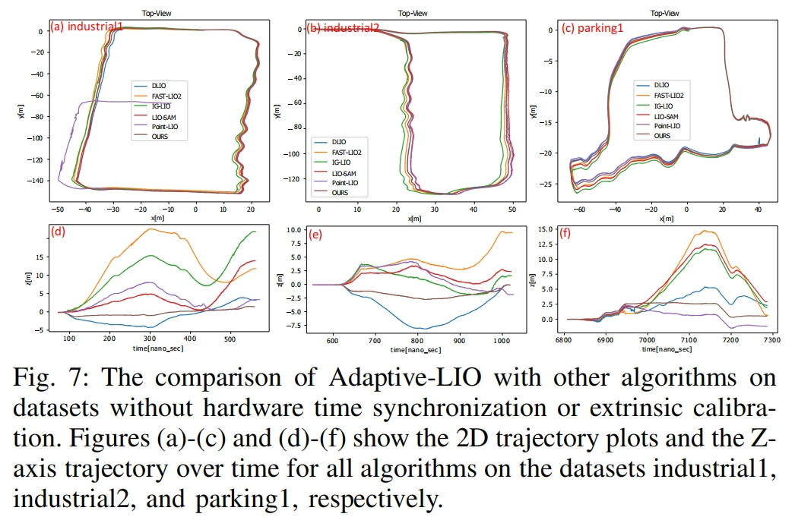
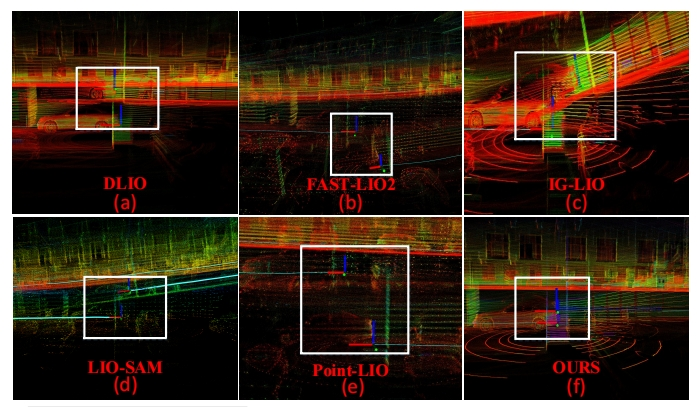
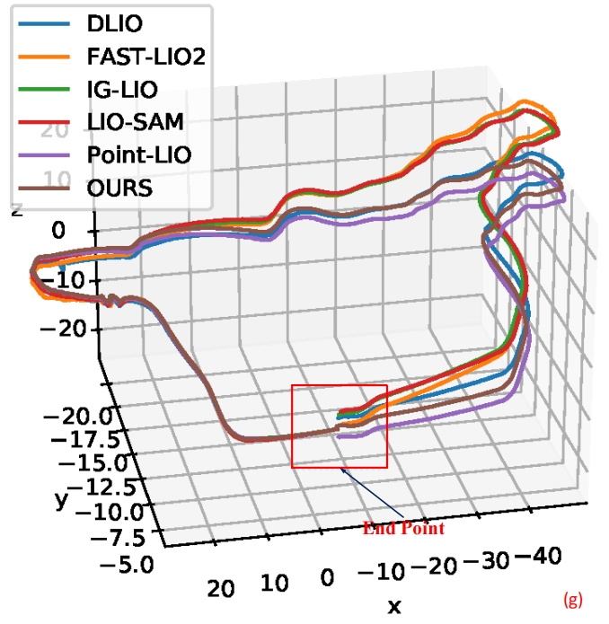

# adaptive_lio
Adaptive-LIO: Enhancing Robustness and Precision through Environmental Adaptation in LiDAR Inertial Odometry

# Data Sequence without strict time synchronization and calibration

##  Platform

  

    
  

  Qisheng L1 mobile chassis.

**notes**: The experimental platform is the Qisheng L1 mobile chassis, which features dual-wheel differential steering. It is equipped with a Velodyne VLP-16 and an external IMU, using an Intel Core i5 as the computing platform. Please note that our IMU and LiDAR have not undergone hardware time synchronization, and the extrinsics betweenthe LiDAR and IMU have not been strictly calibrated.

##  Dataset

<table>
  <tr>
    <th style="text-align:center">Dataset</th>
    <th style="text-align:center">Full Name</th>
    <th style="text-align:center">Duration (s)</th>
    <th style="text-align:center">Distance (km)</th>
    <th style="text-align:center">LiDAR Type</th>
  </tr>
  <tr>
    <td style="text-align:center">QiSheng</td>
    <td style="text-align:center"><a href="https://pan.baidu.com/s/1FBHpDxpykGApxJESxXfk5Q?pwd=yjad" target="_blank">industrial</td>
    <td style="text-align:center">485</td>
    <td style="text-align:center">00</td>
    <td style="text-align:center">Velodyne VLP-16</td>
  </tr>
  <tr>
    <td style="text-align:center">QiSheng</td>
    <td style="text-align:center"><a href="https://pan.baidu.com/s/1uSNeHuNeXuK6kchIEvridQ?pwd=326a" target="_blank">industrial2</td>
    <td style="text-align:center">414</td>
    <td style="text-align:center">00</td>
    <td style="text-align:center">Velodyne VLP-16</td>
  </tr>
  <tr>
    <td style="text-align:center">QiSheng</td>
    <td style="text-align:center"><a href="https://pan.baidu.com/s/1uTexo8NcSUi35cqfo7LdNw?pwd=4rvc" target="_blank">park1</td>
    <td style="text-align:center">479</td>
    <td style="text-align:center">00</td>
    <td style="text-align:center">Velodyne VLP-16</td>
  </tr>
  <tr>
    <td style="text-align:center">QiSheng</td>
    <td style="text-align:center"><a href="https://pan.baidu.com/s/10kaTa2fELM-e7N3PC4sm0g?pwd=xgwm" target="_blank">park2</td>
    <td style="text-align:center">315</td>
    <td style="text-align:center">0.0</td>
    <td style="text-align:center">Velodyne VLP-16</td>
  </tr>

</table>

## end-to-end errors

<table>
  <tr>
    <th style="text-align:center">Dataset</th>
    <th style="text-align:center">DLIO</th>
    <th style="text-align:center">LIO-SAM</th>
    <th style="text-align:center">Point-lio</th>
    <th style="text-align:center">Fast-lio2</th>
    <th style="text-align:center">IG-lio</th>
    <th style="text-align:center">Ours</th>
  </tr>
  <tr>
    <td style="text-align:center">industrial1</td>
    <td style="text-align:center">4.485</td>
    <td style="text-align:center">13.935</td>
    <td style="text-align:center">x</td>
    <td style="text-align:center">11.778</td>
    <td style="text-align:center">21.815</td>
    <td style="text-align:center">**2.4824**</td>
  </tr>
    <tr>
    <td style="text-align:center">industrial2</td>
    <td style="text-align:center">0.185</td>
    <td style="text-align:center">2.467</td>
    <td style="text-align:center">1.778</td>
    <td style="text-align:center">9.547</td>
    <td style="text-align:center">1.737</td>
    <td style="text-align:center">**0.107**</td>
  </tr>
    <tr>
    <td style="text-align:center">parking1</td>
    <td style="text-align:center">1.81</td>
    <td style="text-align:center">2.27</td>
    <td style="text-align:center">3.164</td>
    <td style="text-align:center">5.53</td>
    <td style="text-align:center">1.77</td>
    <td style="text-align:center">**0.492**</td>
  </tr>

</table>

## comparison with others

  

    
  

  The performance of all algorithms on the parking1 dataset.

  

    
  

  Z-axis errors.

